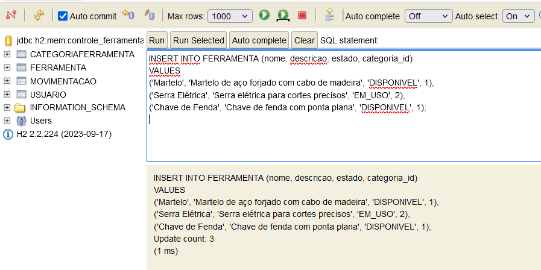

# Controle de Ferramentas

A aplicação **Controle de Ferramentas** é uma solução de microserviços para gerenciar o catálogo de ferramentas de uma oficina. Ela foi projetada para permitir o controle de disponibilidade, uso e movimentação de ferramentas, organizando-as por categorias e registrando seu estado (disponível, em uso, manutenção).

## Estrutura do Projeto

    L:\VSCode\JAVA\DIO\Controle_Ferramentas
    ├── eureka-service
    │   ├── src
    │   │   └── main
    │   │       ├── java
    │   │       │   └── com
    │   │       │       └── dio
    │   │       │           └── eureka
    │   │       │               └── EurekaServiceApplication.java
    │   │       └── resources
    │   │           └── application.yml
    │   └── build.gradle
    ├── ferramenta-catalog-service
    │   ├── src
    │   │   └── main
    │   │       ├── java
    │   │       │   └── com
    │   │       │       └── dio
    │   │       │           └── catalog
    │   │       │               ├── controller
    │   │       │               │   └── FerramentaController.java
    │   │       │               ├── model
    │   │       │               │   ├── Ferramenta.java
    │   │       │               │   ├── CategoriaFerramenta.java
    │   │       │               └── repository
    │   │       │                   └── FerramentaRepository.java
    │   │       └── resources
    │   │           ├── application.yml
    │   │           └── data.sql (povoamento inicial)
    │   └── build.gradle
    ├── api-gateway
    │   ├── src
    │   │   └── main
    │   │       ├── java
    │   │       │   └── com
    │   │       │       └── dio
    │   │       │           └── gateway
    │   │       │               └── ApiGatewayApplication.java
    │   │       └── resources
    │   │           └── application.yml
    │   └── build.gradle
    ├── images
    ├── docker-compose.yml (opcional para rodar os microsserviços em containers)
    └── README.md

## Estrutura e Explicações

1. eureka-service:
    - Este microsserviço será responsável pela descoberta de serviços (usando Eureka).
    - O arquivo application.yml conterá a configuração do Eureka Server.

2. ferramenta-catalog-service:
    - Este será o serviço principal, onde a lógica de CRUD para o catálogo de ferramentas estará implementada.
    - Contém um controlador FerramentaController.java, classes de modelo (Ferramenta.java, CategoriaFerramenta.java), e repositórios (FerramentaRepository.java).
    - Não temos um schema.sql, mas podemos usar um arquivo data.sql para povoar dados iniciais. Sugiro utilizar JPA/Hibernate, que pode gerar o esquema automaticamente. Podemos discutir mais sobre isso conforme a necessidade.

3. api-gateway:
    - Esse serviço será o Gateway para gerenciar e rotear as requisições para os microsserviços (ferramenta-catalog e futuros serviços).
    - O arquivo application.yml conterá as configurações de rotas para cada serviço.

4. images:
    - prints de images da elaboração do projeto

## Imagens do Processo de Criação

Abaixo estão as capturas de tela que ilustram o processo de desenvolvimento da aplicação:

### 1. Configurando o Git Bash para Java 17

### 2. Executando o BootRun do Eureka Service

### 3. Inserindo Ferramentas no H2

### 4. Conexão URL do Gateway no Postman

E muitas outras imagens estão no diretório `images`.

## Relação entre os Arquivos

- application.yml define a configuração da base de dados e o comportamento do Spring Data JPA e do H2.
- data.sql é o script SQL que cria e popula as tabelas no banco H2 na inicialização da aplicação.
- FerramentaController.java define os endpoints da API para manipular dados das ferramentas.
- FerramentaService.java (não discutido aqui, mas correlacionado) contém a lógica de negócios para manipular as ferramentas, chamando o FerramentaRepository para operações de banco de dados.
- FerramentaRepository.java faz o mapeamento das operações JPA com o banco de dados.
- FerramentaCatalogServiceApplication.java é o ponto de entrada para rodar a aplicação.

Essa é a estrutura básica de um projeto Spring Boot com um banco de dados H2. As classes interagem com o banco de dados por meio de repositórios, e as rotas são expostas via controladores REST.

## Comandos Utilizados

- **Build do Projeto**

  ./gradlew clean build --refresh-dependencies

- **Rodando Eureka Service:**

  ./gradlew bootRun

- **Rodando API Gateway:**

  ./gradlew bootRun

## Tecnologias Utilizadas

- **Java 17:** Linguagem de programação principal do projeto.
- **Spring Boot 3.1.4:** Framework usado para desenvolvimento dos microsserviços.
- **Spring Cloud:** Usado para o Eureka Server e Service Discovery.
- **Spring Data JPA:** Para persistência e operações CRUD no banco de dados.
- **H2 Database:** Banco de dados em memória utilizado para testes e desenvolvimento.
- **Gradle 8.10.2:** Ferramenta de build para gerenciar dependências e automação do projeto.
- **Postman:** Utilizado para testar os endpoints da API.
- **Docker (opcional):** Arquivo docker-compose.yml para rodar os serviços em containers.

## Sobre o docker-compose.yml

- O arquivo docker-compose.yml pode ser utilizado para orquestrar a execução dos microsserviços em containers Docker.
- Para rodar todos os serviços simultaneamente:

    docker-compose up

## Considerações Finais

Este projeto de Controle de Ferramentas pode ser expandido com funcionalidades adicionais, como:

- Segurança e Autenticação: Implementar login com controle de acesso para usuários e administradores.
- Integração com Sistemas Externos: A integração com sistemas de gestão de inventário ou ERP pode ser facilmente implementada.
- Relatórios e Análises: Desenvolver relatórios personalizados de uso de ferramentas e movimentação.

## Próximos Passos

- Deploy: Colocar os microsserviços em um servidor real.
- UI/UX: Desenvolver uma interface gráfica para os usuários interagirem com o sistema.
- Segurança: Implementar autenticação e controle de acesso.
- Escalabilidade: Expandir o sistema com novos microsserviços e integrações.

Este arquivo README.md documenta a estrutura e operação do sistema, além de fornecer uma visão geral das tecnologias e processos utilizados no desenvolvimento.

Este arquivo `README.md` está formatado para ser visualizado diretamente no GitHub ou qualquer outra plataforma de versionamento que suporte Markdown. Ele inclui as imagens diretamente no corpo do documento e explica a estrutura do projeto, comandos utilizados, e as tecnologias empregadas.
